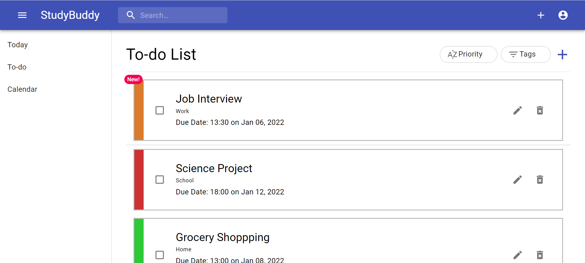

<div id="top"></div>

<!-- PROJECT SHIELDS -->
[![Contributors][contributors-shield]][contributors-url]
[![MIT License][license-shield]][license-url]
[![Alex's LinkedIn][linkedin-shield]][linkedin-url]
[![Michael's LinkedIn][linkedin-shield]][linkedin-url2]

<!-- PROJECT LOGO -->
<br />
<div align="center">
  <a href="https://github.com/alexl0806/orgtool">
    
  </a>

  <p align="center">
    The Study Buddy provides a clean and efficient scheduling tool in which a user can create, delete and edit tasks, while also being notified of upcoming deadlines.
    <br />
  </p>
</div>

<!-- TABLE OF CONTENTS -->
<details>
  <summary>Table of Contents</summary>
  <ol>
    <li>
      <a href="#about-the-project">About The Project</a>
      <ul>
        <li><a href="#built-with">Built With</a></li>
      </ul>
    </li>
    <li>
      <a href="#getting-started">Getting Started</a>
      <ul>
        <li><a href="#prerequisites">Prerequisites</a></li>
        <li><a href="#installation">Installation</a></li>
      </ul>
    </li>
    <li><a href="#license">License</a></li>
    <li><a href="#contact">Contact</a></li>
  </ol>
</details>

<!-- ABOUT THE PROJECT -->
## About The Project



<p align="right">(<a href="#top">back to top</a>)</p>

### Built With

* [React.js](https://reactjs.org/)
* [Material-UI](https://mui.com/)
* [Express.js](https://expressjs.com/)
* [Node.js](https://nodejs.org/en/)
* [MongoDB](https://www.mongodb.com/)

<p align="right">(<a href="#top">back to top</a>)</p>

<!-- GETTING STARTED -->
## Getting Started

Here is how to get a local copy of our code up and running.

### Prerequisites

For this project, the only prerequisite is Node.js. The steps below demonstrate how to install Node.js onto your system:
* npm
  ```sh
  npm install npm@latest -g
  ```

### Installation

1. Clone the repo
   ```sh
   git clone https://github.com/alexl0806/orgtool.git
   ```
2. Create a MongoDB Database, locate the MongoDB Connection URI and copy it.
3. Under the server folder, create a .env file containing CONNECTION_URL= YOUR_CONNECTION_URI
4. Install NPM packages
   ```sh
   npm install
   ```

<p align="right">(<a href="#top">back to top</a>)</p>

<!-- LICENSE -->
## License

Distributed under the MIT License. See `LICENSE.txt` for more information.

<p align="right">(<a href="#top">back to top</a>)</p>

<!-- CONTACT -->
## Contact

Alex Liu - alexliu0806@gmail.com
</br>
Michael Cheng - mccheng37@gmail.com

Project Link: [https://github.com/alexl0806/orgtool](https://github.com/alexl0806/orgtool)

<p align="right">(<a href="#top">back to top</a>)</p>

<!-- MARKDOWN LINKS & IMAGES -->
<!-- https://www.markdownguide.org/basic-syntax/#reference-style-links -->
[contributors-shield]: https://img.shields.io/github/contributors/alexl0806/orgtool.svg?style=for-the-badge
[contributors-url]: https://github.com/alexl0806/orgtool/graphs/contributors
[license-shield]: https://img.shields.io/github/license/alexl0806/orgtool.svg?style=for-the-badge
[license-url]: https://github.com/alexl0806/orgtool/blob/master/LICENSE.txt
[linkedin-shield]: https://img.shields.io/badge/-LinkedIn-black.svg?style=for-the-badge&logo=linkedin&colorB=555
[linkedin-url]: https://linkedin.com/in/michael-cheng-2561a5220
[linkedin-url2]: https://www.linkedin.com/in/alex-liu-0806/
[product-screenshot]: images/screenshot.png